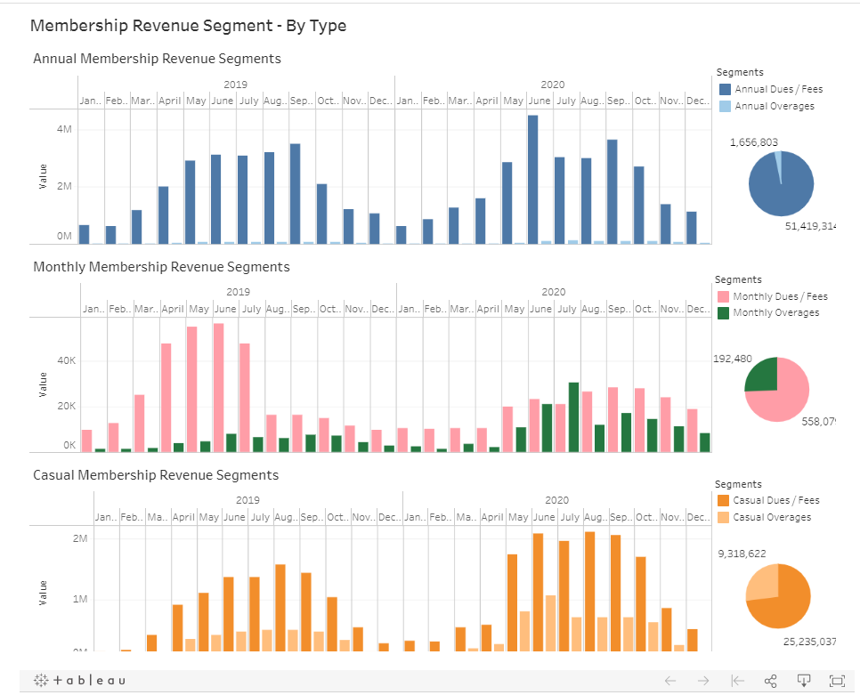

**Citi Bike**

Visual analysis of Citi Bike Services (New York area), charting trends in
utilization, inventory, maintenance, user profiles, user choices, and even
impact from SARS COVID-2

**Live Web Site Link**

The repository does not contain the live website. That website can be reached at
[https://public.tableau.com/profile/brooke.cooper\#](https://public.tableau.com/profile/brooke.cooper#)!.

**Citi Bike Financial Report Data (1) – 3 Membership Revenue Segments - By
Type**

-   3 stacked bar charts provide a view of revenues by the three principal
    membership types – including annual membership, monthly membership, and
    casual (ad-hoc) membership – cross-sliced according to two membership fee
    types -- dues and overages. Each bar charts’ x-axis corresponds to each of
    the months for the 2-year period 2019-2020. The y-axis represents revenue in
    US dollars; their scales vary.

-   The 3 pie charts off to the right of each of the stacked bar charts roll up
    each of the membership revenue segments for the entire period 2019-2020.

-   The purpose for showing revenue streams in this manner is to show the
    relative contribution of overages to total membership revenue segment.

-   Overages (late fees, damage fees, etc.) for the Annual Membership Revenue
    segment accounted for a very small fraction of total annual membership
    revenues. By contrast, overages for the Monthly and Casual Membership
    revenue segments accounted for a whopping quarter of their respective
    revenue streams. In fact, in July 2020 overages exceeded dues in the monthly
    membership segment.

-   The significance of the contribution of such overages is the potential for
    sticker shock on the part of monthly subscribers and ad-hoc customers. This
    could potentially leave a sour taste in the mouths of customers in customer
    segments that are growing.

**  
**

**Citi Bike Financial Report Data (2) – Total Revenue - Analysis of Major
Components**

-   Top bar chart provides a view of Gross Revenues by the three principal
    membership revenue streams, sponsorships, and taxes collected by month for
    the period 2019-2020. The pie chart off to the right of the bar chart rolls
    up each of these revenue segments for the entire period 2019-2020. What is
    evident is the increasing contribution of corporate sponsorships to the
    overall revenue stream of Citi Bike, which accounts for a whopping
    one-quarter of gross revenues for the entire 2-year period.

-   Lower bar chart provides a view of Gross Revenues – with a view of two
    components: (1) Total Gross Revenue and (2) Refunds/Discounts. In this view
    the refunds and discounts are not netted out but actually shown (in
    negative) and provide an idea of the importance of refunds/discounts for any
    month. The pie chart off to the right of the bar chart rolls up each of
    these revenue segments for the entire period 2019-2020.

-   Normally, refunds/discounts increase during the height of seasonal demand,
    the warmer months. But in June of 2020 there was an abnormal and significant
    spike in refunds and discounts relative to total gross revenues. It might be
    reasonable to imagine that this spike corresponds to the initial mass shock
    of the pandemic, particularly as it hit the New York City region
    particularly hard right around that time. Subsequent to that month,
    discounts and refunds seem to have declined to more normal relative levels.

**  
**

**Citi Bike Financial Report Data (3) – Station Operations**

**  
**

**Citi Bike Financial Report Data (4) – Bike Fleet Utilization & Maintenance**

**Citi Bike Trip Data (1) – Ridership and Utilization by Age & Gender**

-   4 bar charts providing a deeper look at ridership and utilization by age and
    gender. They are searchable by gender. In a future version, we might want to
    consider making it searchable by age.

-   The top two bar charts -- (1) Trips per Month by Age Group and (2) Average
    Trip Duration by Age -- to provide demographic insights (at least for the
    age and gender data available – we note race, income level, ethnicity,
    religion, sexual orientation, etc. were not part of the data set). Across
    the entire population of customers the largest age category concentration,
    by far, is for people in their 30s. The principle age range was for people
    in their 20s to those in their 50s. Of the principle customer age groups,
    people in their 50s took the longest average trips, followed by people in
    their 20s. (We ignored spikes for average trip duration for teens and those
    in their 80s since they constitute very small customer constituencies.)
    Interestingly, the proportional age differences when viewed by gender didn’t
    seem to be materially different.

-   The middle graph (Trips by Customer Type) provides a composite with two
    side-by-side bar chart views: one of trips by annual subscription customers
    and the other of trips by monthly subscription customers and ad-hoc
    customers. Because the y-axis is common for the side-by-side charts, it is
    easy to see that annual subscription holders take far more trips than ad-hoc
    customers. The x-axis for each view corresponds to each of the months for
    the 2-year period 2019-2020.

-   Interestingly, it is also clear that the number of trips by annual
    subscription holders seems to have declined in 2020 vs. 2019, whereas the
    number of trips by ad-hoc customers increased significantly in 2020 vs.
    2019\. I suspect it might be worthwhile investigating (1) whether the
    pandemic played a role in the decline, (2) whether the monthly subscription
    and ad-hoc rental models have cannibalized annual subscriptions, (3) whether
    these trends will reverse as the economy recovers from the pandemic, and/or
    (4) whether these trends represent permanent customer behavior shifts.

-   The bottom graph (Rider’s Gender) provides an overlay bar chart comparison
    of revenue by month of all types by gender, including the categories male,
    female, and not identified. We observe significantly greater utilization by
    men than women. The x-axis corresponds to each of the months for the 2-year
    period 2019-2020.

-   We also observe significant seasonality in both (1) trips by customer type
    (middle graph) and (2) revenue by gender (bottom graph). There is virtually
    no directional magnitude difference in seasonality by gender.

-   Gender “not identified” seems to correlate to simple customer identification
    form processing laziness. The trend seems to be that ad-hoc customers were
    significantly less likely to identify gender than annual and monthly
    subscribers.

-   Note: choosing a particular year-view and/or station-view propagates to the
    other similarly selectable graphs.

**Citi Bike Trip Data (2) – Avoid Peak Rental Hours!**

-   4 bar charts, one for each season, that depict peak rental hours. They are
    searchable by station (or cluster of stations) and by year. There were some
    eye-opening differences by stations in terms of peak rental hours. In some
    cases, peak hours for individual bike stations varied materially in 2019 vs.
    2020.

-   This web page allows an intelligent customer to use the map (Citi-Bike Trip
    Data (6) to identify the nearest bike stations and then to look up and
    compare peak rental hours for each of those selected stations. Thus, the
    customer could select the most convenient station with the highest
    likelihood of available bikes and smallest customer queues. Further, Citi
    Bike operations could use this tool to create an algorithm to tweak the
    number of bikes it places at its stations.

-   In the aggregate, across all stations, certain morning (8am) and early
    evening hours (5pm and 6pm) tend to spike similarly across all seasons.
    Interestingly the morning spike (single hour average) exceeded the early
    evening spike in winter and spring, whereas the early evening spike exceeded
    the morning spike in summer and fall. Not surprisingly, we also observe that
    summer shows a materially greater demand than did the other seasons.

-   Note: choosing a particular year-view and/or station-view propagates to the
    other similarly selectable graphs.

**  
**

**Citi Bike Trip Data (3) – Probable Servicing**

****

-   Bar chart showing the top locations where bikes are repeatedly abandoned
    rather than returned to an official bike station. If the locations are
    relatively safe, management might consider whether these identified
    abandonment locations could potentially serve as new bike stations.

-   Bar chart showing the frequency of bike abandonment for 2019 and 2020 by
    month. Clearly, bike abandonment was seasonal. Prima facie, it is doubtful
    that the abandonment rate per bike use is seasonal, but we would need to
    calculate that to be sure.

-   Box plots of utilization (hours) and count of trips for each bike, which we
    believe give some form of proxy indications of the health of each bike in
    service, assuming the health of each bike is generally a function of
    weathering (outdoor time), wear-and-tear, and offsetting
    maintenance-and-repair. The box plot shows a median of 101 hours and 245
    trips per bike, with 50% of bikes in the range of between 21 and 165 hours
    and between 63 and 692 trips. We note there are quite a lot of bikes north
    of the upper whisker at 382 hours and 1,206 trips. With good quality
    controls, it is quite possible these figures reflect an acceptable level of
    rotation and bike retirement. On the other hand, these figures may reflect
    quite a bit of variance in terms of bike performance and user experience,
    which could adversely affect future utilization and revenue production.

-   All graphs display “hover-able” data

**Citi Bike Trip Data (4) - Seasonality & Trip Duration**

-   Bar charts showing (1) total trips by all bikes per month, (2) average trips
    per bike per month, and (3) longer trip frequency are each highly seasonal,
    with spikes tracking the warmer months, as one might anticipate.

-   Bar chart showing maximum use duration generally tended to be seasonal also,
    but there was greater variation than for the other metrics.

-   Bar charts showing (1) average trips per bike per month and (2) longer trip
    frequency, including both (a) trips of greater than 2 hour duration and (b)
    bike rentals of greater than 1 day, showed clear increases comparing peak
    months in 2020 over peak months in the prior year. The increase in the total
    bike population has been gradual and therefore does not evidently account
    for the increase in 2020. It is possible that the advent of the pandemic
    might account for the spike. It might be interesting to track these monthly
    trends into 2021 and beyond. It is also possible that other factors
    (permanent shift of some kind, changes in marketing programs, etc.) could
    account for the increase. Ascertaining that through further research might
    be worthwhile.

-   All graphs display “hover-able” data

**Citi Bike Trip Data (6) – Map**

-   Dynamic city-street map depicting Lower Manhattan and surrounding area Citi
    Bike stations

-   Each location lists station name and geocoordinates

-   Searchable by drop-down list of station names
